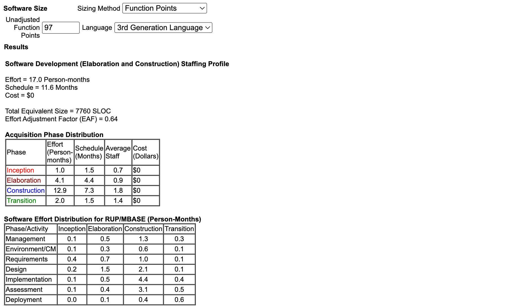

#  Estimation Booklet – Function Point Analysis (FPA)

This section estimates the functional size and relative complexity of the project using Function Points. The analysis is based on the documented requirements and user stories in the Requirements Booklet.

Provided complexity tables to be strictly followed for classification and weights:

### ILF/EIF Complexity
| Ret/Det   | 1–19 Det      | 20–50 Det      | 51+ Det        |
|-----------|---------------|----------------|----------------|
| 1 Ret     | Low (7/5)     | Low (7/5)      | Medium (10/7)  |
| 2–5 Ret   | Low (7/5)     | Medium (10/7)  | High (15/10)   |
| 6+ Ret    | Medium (10/7) | High (15/10)   | High (15/10)   |

---

### External Input (EI) Complexity
| FTR/DET   | 1–4 DET     | 5–15 DET    | 16+ DET     |
|-----------|-------------|-------------|-------------|
| 0–1 FTR   | Low (3)     | Low (3)     | Medium (4)  |
| 2 FTR     | Low (3)     | Medium (4)  | High (6)    |
| 3+ FTR    | Medium (4)  | High (6)    | High (6)    |

---

### External Output / External Inquiry (EO/EQ) Complexity
| FTR/DET   | 1–5 DET     | 6–19 DET    | 20+ DET     |
|-----------|-------------|-------------|-------------|
| 0–1 FTR   | Low (4/3)   | Low (4/3)   | Medium (5/4) |
| 2–3 FTR   | Low (4/3)   | Medium (5/4) | High (7/6)  |
| 4+ FTR    | Medium (5/4) | High (7/6)  | High (7/6)  |

---

## 1) Identify Logical Files
Logical files represent the persistent logical groups of user-maintained data.

Internal Logical Files (ILF): with RET/DET counts and derived complexity
- ILF-1: Users (CustomUser)
  - DET (fields): email, username, first_name, last_name, profile_image, role, is_active, is_staff, password hash, last_login, date_joined → 11 DET
  - RET (record types): 1 (single group of user data)
  - Table rule → 1 RET and 1–19 DET ⇒ Low for ILF (7 FP)
- ILF-2: Books (Book)
  - DET: isbn, title, description, abstract, author, published, cover, genre, language, available_copies → 10 DET
  - RET: 1 (single book entity)
  - Table rule → 1 RET and 1–19 DET ⇒ Low for ILF (7 FP)
- ILF-3: Reservations (Reservation)
  - DET: user_id, book_id, timestamp, fulfilled, ready_for_pickup, returned, position, cancelled → 8 DET
  - RET: 1 (single reservation entity)
  - Table rule → 1 RET and 1–19 DET ⇒ Low for ILF (7 FP)

External Interface Files (EIF): 
- None 

Count and Complexity
- ILF: 3 Low (Users, Books, Reservations)
- EIF: 0 

- ILF FP = 3×7 = 21
- EIF FP = 0

Subtotal (Files) = 21 FP

---

## 2) Identify Transactions
Transactions are user-recognizable operations that cross the application boundary. For each, we estimate FTR (referenced logical files) and DET (input/output data elements) to derive complexity.

External Inputs (EI): data entering the app to maintain ILFs (FTR, DET → complexity)
- EI-1: Register user [US4]
  - FTR: Users (1); DET: ~6–10 fields ⇒ bucket 5–15 ⇒ 1 FTR & 5–15 DET → Low (3 FP)
- EI-2: Login [US5]
  - FTR: Users (1); DET: 2–3 ⇒ 1–4 bucket → Low (3 FP)
- EI-3: Edit profile [US13]
  - FTR: Users (1); DET: ~5–10 ⇒ 5–15 bucket → Low (3 FP)
- EI-4: Delete account [US15]
  - FTR: Users (1); DET: 1–2 ⇒ 1–4 bucket → Low (3 FP)
- EI-5: Add book [US16]
  - FTR: Books (1); DET: ~6–10 ⇒ 5–15 bucket → Low (3 FP)
- EI-6: Edit book [US17]
  - FTR: Books (1); DET: ~5–10 ⇒ 5–15 bucket → Low (3 FP)
- EI-7: Delete book [US16]
  - FTR: Books (1); DET: 1–2 ⇒ 1–4 bucket → Low (3 FP)
- EI-8: Create reservation [US8]
  - FTR: Reservations (1), Books (1) ⇒ 2 FTR; DET: ~3–8 ⇒ 5–15 bucket → Medium (4 FP)
- EI-9: Update reservation status (librarian) [US18]
  - FTR: Reservations (1) ⇒ 1 FTR; DET: ~3–8 ⇒ 5–15 bucket → Low (3 FP)
- EI-10: Join waitlist [US10]
  - FTR: Reservations (1) ⇒ 1 FTR; DET: 1–4 ⇒ Low (3 FP)
- EI-11: QR scan/verify reservation [US19]
  - FTR: Reservations (1), Books (1), Users (1) ⇒ 3 FTR; DET: ~3–8 ⇒ 5–15 bucket → High (6 FP)

External Outputs (EO): derived info leaving the app 
- EO-1: Reservation confirmation output [US9]
  - FTR: Reservations (1), Books (1), Users (1) ⇒ 3 FTR; DET: ~3–10 ⇒ 6–19 bucket → Medium (5 FP)
- EO-2: Notification “book ready” [US11]
  - FTR: Reservations (1), Users (1) ⇒ 2 FTR; DET: ~2–6 ⇒ 1–5/6–19 → assume 6–19 → Medium (5 FP)
- EO-3: Recommendations on dashboard [US14]
  - FTR: Books (1), Users (1) ⇒ 2 FTR; DET: 6–19 → Medium (5 FP)
- EO-4: Librarian dashboard analytics [US20]
  - FTR: Reservations (1), Books (1) ⇒ 2 FTR; DET: 6–19 → Medium (5 FP)

External Inquiries (EQ): simple retrieval
- EQ-1: Browse catalog [US1, US3]
  - FTR: Books (1) ⇒ 1 FTR; DET: filters/sort params + displayed fields ≈ 6–19 → Low (3 FP) per table (0–1 FTR & 6–19 DET → Low)
- EQ-2: Search books [US2]
  - FTR: Books (1) ⇒ 1 FTR; DET: 6–19 → Low (3 FP)
- EQ-3: View book details [US7]
  - FTR: Books (1) ⇒ 1 FTR; DET: 1–5 → Low (3 FP)
- EQ-4: View personal area [US12]
  - FTR: Users (1), Reservations (1) ⇒ 2 FTR; DET: 6–19 → Medium (4 FP)
- EQ-5: View reservation management list [US18]
  - FTR: Reservations (1), Users (1), Books (1) ⇒ 3 FTR; DET: 6–19 → High (6 FP)

Subtotal checks using table weights:
- EI FP = 3+3+3+3+3+3+3+4+3+3+6 = 37 FP
- EO FP = 5+5+5+5 = 20 FP
- EQ FP = 3+3+3+4+6 = 19 FP

Subtotal (Transactions) = 37 + 20 + 19 = 76 FP

---

## 3) Unadjusted Function Points (UFP)

UFP = Files (21) + Transactions (76) = 97 FP

---
## 4) COCOMO II
The unadjusted function points were used as input to the COCOMO II model in order to estimate the development effort, cost, and schedule.
The estimation was carried out using the official COCOMO II tool made available by the University of Southern California (USC), the institution where the model was originally developed:
http://softwarecost.org/tools/COCOMO/

Here we report our computation:
