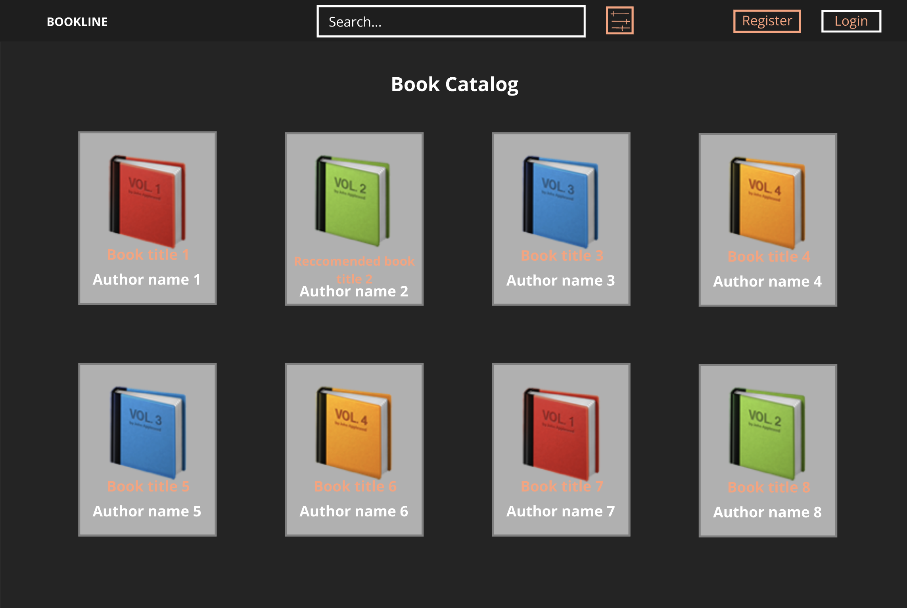
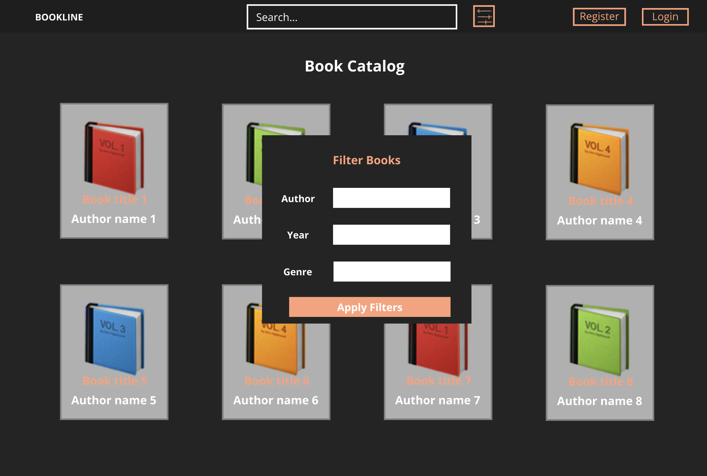
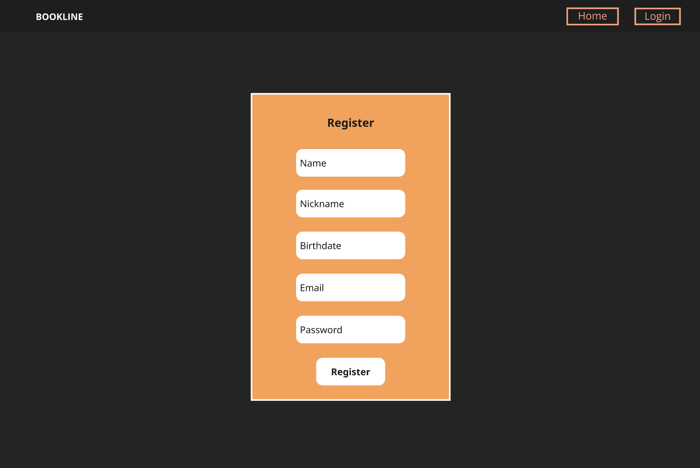
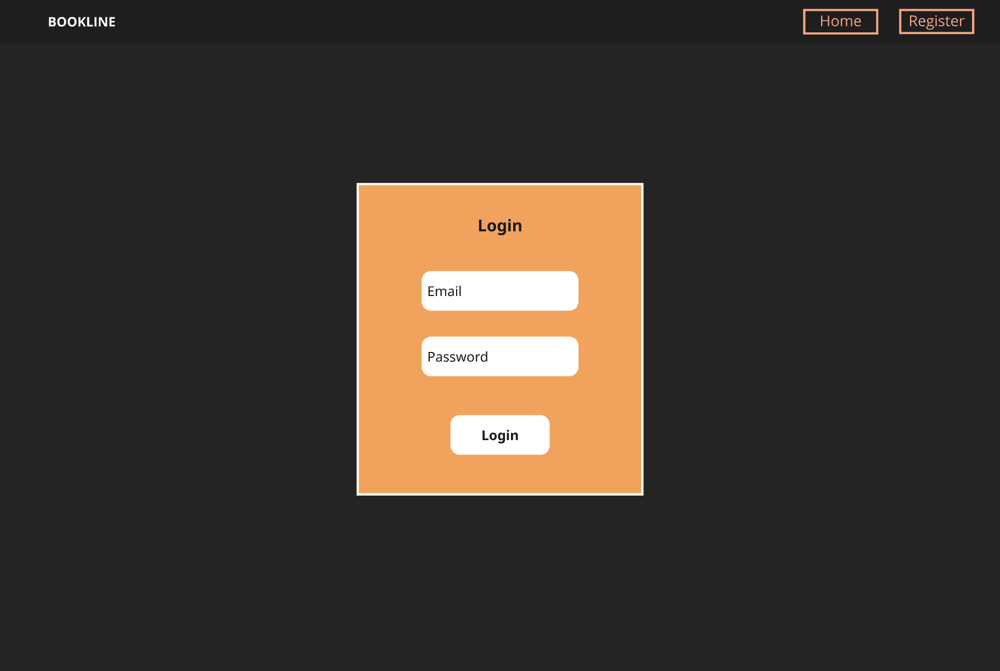
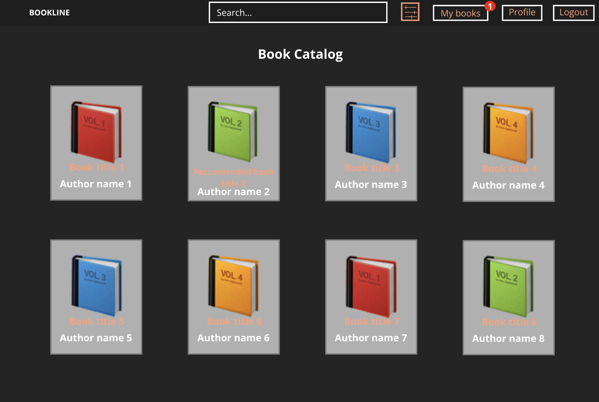
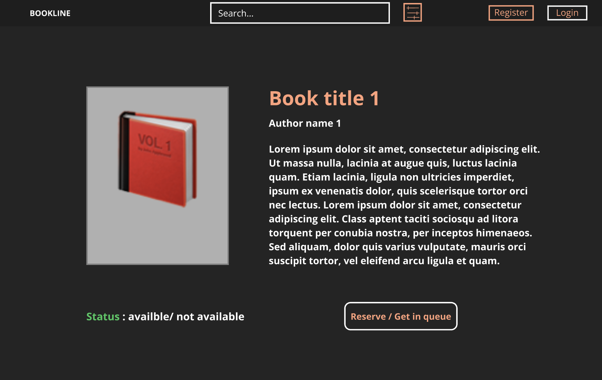
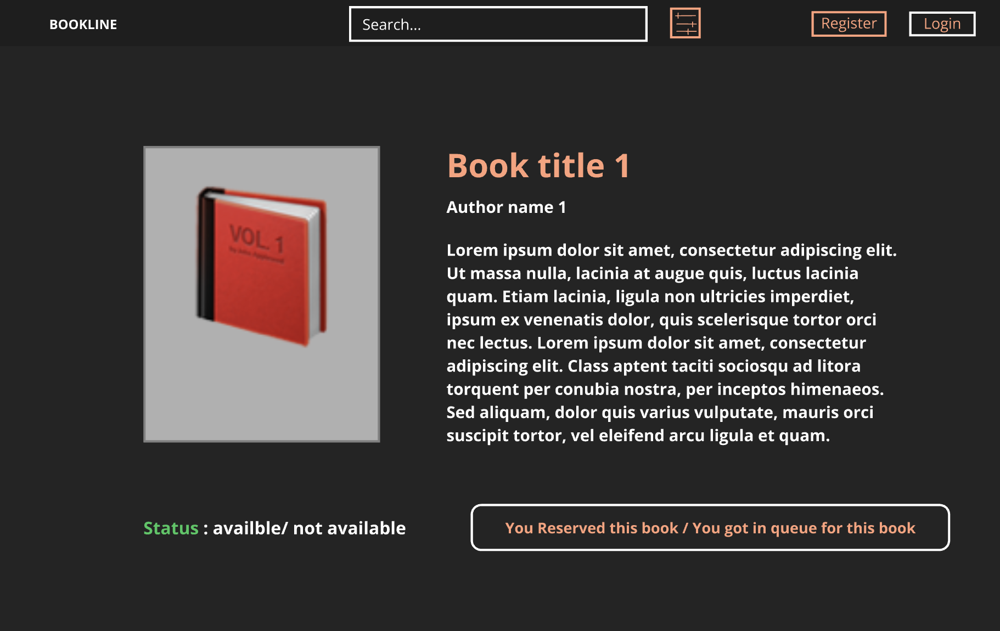
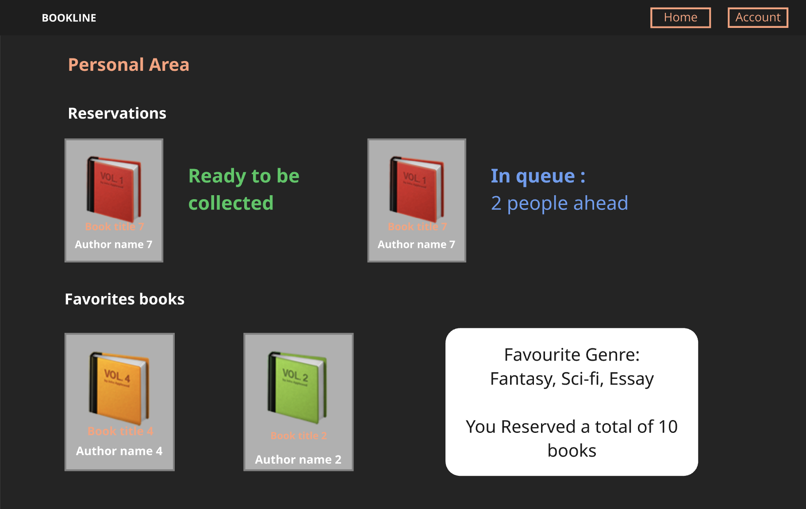
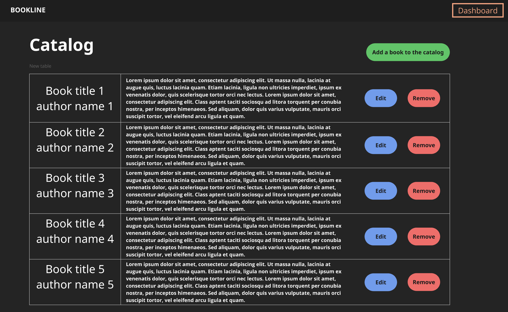
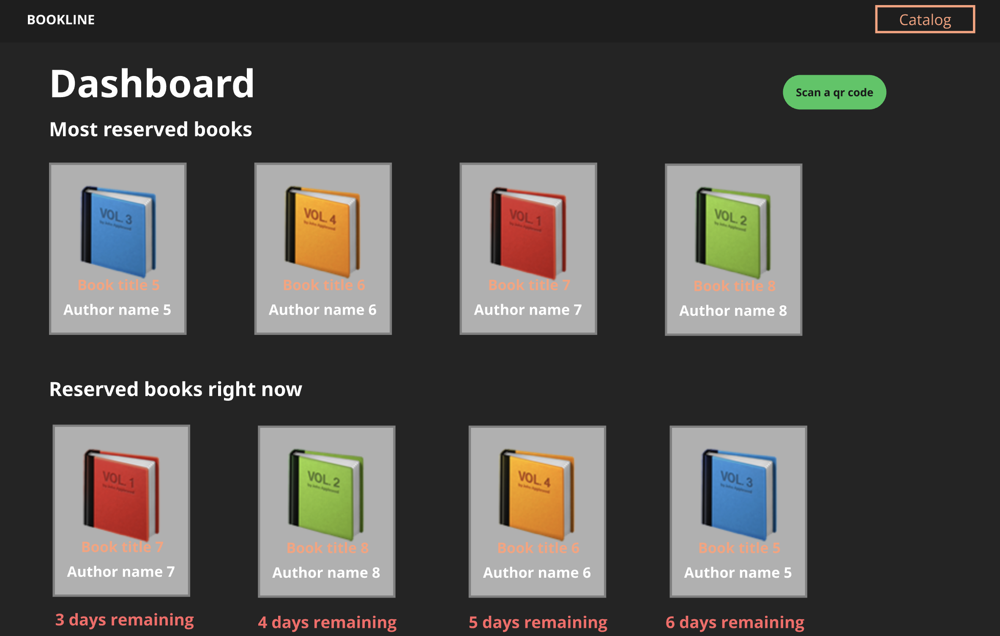

# 📘 Requirements Booklet

## 1. Introduction
This document collects all user stories for Bookline. Each story includes the role, description, acceptance criteria, and a placeholder for the corresponding mockup.

---

## 2. User Stories

### US1 – Browse Books
**Role**: Guest  
**Description**: As a Guest, I want to browse all available books so that I can explore the entire catalog.  
**Acceptance Criteria**:
- Guest can see the catalog without login.
- Catalog is paginated or scrollable.  

### US2 – Search Books
**Role**: Guest  
**Description**: As a Guest, I want to search for books by author, genre, title, or publication date so that I can easily find specific books of interest.  
**Acceptance Criteria**:
- Search bar available on catalog page.
- Results match the query keywords.  

**Mockup**: 

---

### US3 – Filter and Sort Books
**Role**: Guest  
**Description**: As a Guest, I want to filter and sort books in the catalog so that I can quickly find the books I’m looking for.  
**Acceptance Criteria**:
- Filters by genre, availability, publication year.
- Sorting by author, title, or date. 

**Mockup**: 

---

### US4 – Create Personal Account
**Role**: Guest  
**Description**: As a Guest, I want to create a personal account so that I can register and access additional services.  
**Acceptance Criteria**:
- Registration form includes email, password, and personal details.
- Confirmation message shown after registration.  

**Mockup**: 

---

### US5 – Login
**Role**: Registered User  
**Description**: As a Registered User, I want to log in using my email and password so that I can access my profile and personalized services.  
**Acceptance Criteria**:
- Login form available on homepage.
- Successful login redirects to user dashboard.

**Mockup**: 

---

### US6 – Logout
**Role**: Registered User  
**Description**: As a Registered User, I want to log out from my account so that I can end my session.  
**Acceptance Criteria**:
- Logout option available in navigation or settings.
- User is redirected to homepage after logout.

### US14 – Personalized Recommendations
**Role**: Registered User  
**Description**: As a Registered User, I want to receive personalized book recommendations so that I can find books based on my interests and reading habits.  
**Acceptance Criteria**:
- Recommendation section displayed on user dashboard.  

**Mockup**: 

---

### US7 – View Book Details
**Role**: Registered User  
**Description**: As a Registered User, I want to view detailed information about a book so that I can evaluate it before deciding to borrow or reserve it.  
**Acceptance Criteria**:
- Book detail page displays title, author, description, availability.  

### US8 – Reserve Available Books
**Role**: Registered User  
**Description**: As a Registered User, I want to reserve available books so that I can visit the library and collect them later.  
**Acceptance Criteria**:
- Reservation button available on book detail page.
- Confirmation message after successful reservation.

### US10 – Join Waitlist
**Role**: Registered User  
**Description**: As a Registered User, I want to join a waitlist when a book is unavailable so that I can be notified when it becomes available.  
**Acceptance Criteria**:
- Waitlist option available for unavailable books.
- Notification sent when book becomes available.  

**Mockup**: 

---

### US9 – Reservation Confirmation
**Role**: Registered User  
**Description**: As a Registered User, I want to receive a confirmation when I successfully reserve a book so that I can confirm my reservation with the library staff.  
**Acceptance Criteria**:
- System displays reservation confirmation message.
- Confirmation email or notification sent.  

**Mockup**: 

---

### US11 – Notification for Reserved Book
**Role**: Registered User  
**Description**: As a Registered User, I want to know when it’s my turn to collect a reserved book so that I can promptly visit the library.  
**Acceptance Criteria**:
- System sends notification when book is ready for collection.  

### US12 – Personal Area
**Role**: Registered User  
**Description**: As a Registered User, I want to view my personal area so that I can track my reservations, favorite books, and reading statistics.  
**Acceptance Criteria**:
- Personal area displays user reservations, favorites, and stats.  

**Mockup**: 

---

### US13 – Edit Profile
**Role**: Registered User  
**Description**: As a Registered User, I want to edit my profile information so that I can keep my preferences and interests up to date.  
**Acceptance Criteria**:
- User can edit email, password, and personal preferences.
- Changes saved successfully.

### US15 – Delete Account
**Role**: Registered User  
**Description**: As a Registered User, I want to delete my account from a settings page so that I can permanently remove my data from the system.  
**Acceptance Criteria**:
- Delete option available in settings.
- Confirmation required before deletion.  

**Mockup**: 

---

### US16 – Manage Catalog (Add/Delete Books)
**Role**: Librarian  
**Description**: As a Librarian, I want to add or delete books from the catalog so that users always have access to the most current collection.  
**Acceptance Criteria**:
- Add book form and delete option available.
- Catalog updates instantly.

### US17 – Edit Book Information
**Role**: Librarian  
**Description**: As a Librarian, I want to process and edit book information so that I can ensure the catalog is always accurate and up to date.  
**Acceptance Criteria**:
- Edit form available for each book.
- Updates reflected in catalog.  

**Mockup**: 

---

### US18 – Reservation Management
**Role**: Librarian  
**Description**: As a Librarian, I want to access a reservation management page so that I can track borrowed and returned books.  
**Acceptance Criteria**:
- Reservation management page displays all active reservations.
- Status can be updated by librarian.  

### US19 – QR Code Scanning
**Role**: Librarian  
**Description**: As a Librarian, I want to scan QR codes to verify book reservations so that I can manage the borrowing process efficiently.  
**Acceptance Criteria**:
- QR code scanning tool integrated.
- Verification message displayed after scan.  

### US20 – Library Dashboard
**Role**: Librarian  
**Description**: As a Librarian, I want to access the library dashboard so that I can review user trends and improve library services accordingly.  
**Acceptance Criteria**:
- Dashboard displays statistics on user activity and catalog usage.  

**Mockup**: 
